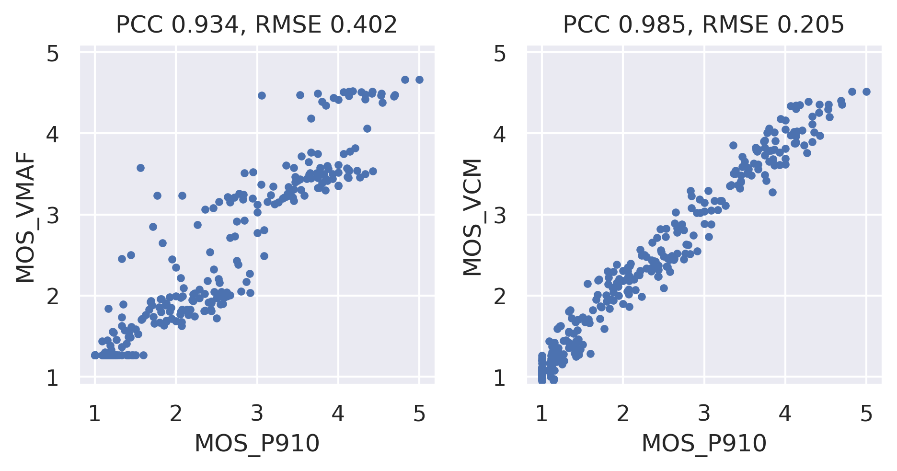
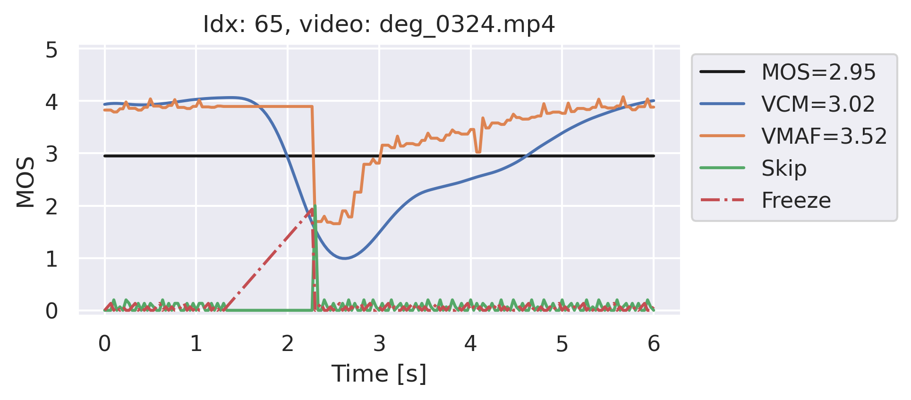
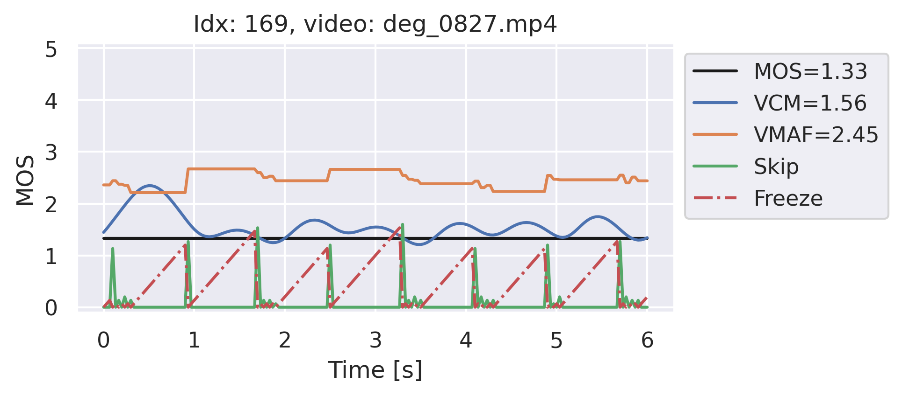

# Video Call MOS
This repository provides the code and dataset for the Video Call MOS (VCM) prediction model, accepted at ICASSP 2023. 
The model predicts the perceived video quality of videos that were transmitted via videoconferencing calls.
In contrast to other state-of-the-art video mos models it is able to take temporal distortions, such as video freezes, into account.
We further provide a dataset with live Microsoft Teams video recordings and crowdsourced subjective quality ratings using [P.910 Crowd](https://github.com/microsoft/P.910). 
The prediction is performed with the following steps.

 1. Time-alignment of reference video via QR-code marker detection
 2. VMAF Computation
 3. Frame freeze feature computation based on time-alignment indices
 4. Predict MOS with Video Call MOS LSTM, using VMAF and frame freeze features as input

## Validation Results
In comparison to VMAF, the proposed VCM model performs better on videos with temporal distortions. The following figure shows how VMAF overestimates the quality for multiple samples in the validation dataset.
<br><br>

The following example shows the per-frame predictions for a video that is impaired by a single freeze of around 1 second. According to the crowdsourced ratings, the ground truth video quality MOS is 2.95. Because VMAF does not take the freeze into acount, it overestimates the quality with a score of 3.52. In contrast, the proposed VCM model reduces the predictions during frozen frames, resulting in an overall MOS score close to the ground truth.
<br><br>

The next figure shows a similar effect but instead with multiple shorter frame freezes.
<br><br>


For more information see the paper here (tbd)

## Requirements
The code in this repository was tested on Ubuntu. Adjustments to the FFMPEG commands may be necessary when running on Windows.
To perform reference video alignment and VMAF computation, FFMPEG with VMAF support is required, which can be installed on Ubuntu via the following steps (optional for training and evaluation on the VCM dataset, as pre-computed VMAF features are available in CSV files).
See also https://www.johnvansickle.com/ffmpeg/faq for more info on the FFMPEG installation.

```bash
apt-get update -y
apt-get install -y libzbar0 libgl1 # needed for reading QR-codes
wget -q https://johnvansickle.com/ffmpeg/builds/ffmpeg-git-amd64-static.tar.xz
tar xf ffmpeg-git-amd64-static.tar.xz
mv ffmpeg-git-*-amd64-static/ffmpeg ffmpeg-git-*-amd64-static/ffprobe /usr/local/bin/
```

It is recommended to create a new virtual or conda environment dedicated to the project. Use the following command to install the required python packages via pip.

```bash
pip install requirements.txt
```

## Dataset
Before running the code, it is necessary to download the Video Call MOS dataset. Please note that the dataset is a subset of the one used in the paper. It can be found here:

https://challenge.blob.core.windows.net/video-call-mos/video_call_mos_set.zip

The dataset contains 10 reference videos and 1467 degraded videos that were transmitted via Microsoft Teams calls and contain various typical video call distortions. It also includes [P.910 Crowd](https://github.com/microsoft/P.910) subjective video MOS ratings (see paper for more info).

## Evaluating
To evaluate the default VCM or a newly trained model, the following script can be run. It also plots correlation diagrams and per-frame MOS predictions and compares the results to VMAF (it should reproduce exactly the same results as shown above in [Validation results](#Validation-results)). The path variables `data_dir` and `csv_file` within the script need to be updated before executing. 

```bash
python run_evaluation_and_plotting.py   
```

The script is using the pre-computed VMAF features and alignment indices loaded from CSV files as inputs to the VCM model. For a new dataset, new CSV files can be written by using the `run_video_call_mos_on_dataset.py` script (see [Video Quality Prediction](#Video-Quality-Prediction)).

## Video Quality Prediction
To predict the MOS score of a single video file, the following command can be used:
```bash
python run_video_call_mos.py --deg_video /path/to/video_call_mos_set/data/deg_0001.mp4 --ref_video /path/to/video_call_mos_set/data/ref_01.mp4 --results_dir /path/to/video_call_mos_set/results --tmp_dir /path/to/video_call_mos_set/tmp
```
This command requires longer computation time and will run the inference end-to-end, including QR-code detection, reference alignment, VMAF computation, and Video Call MOS LSTM model. Note that the code expects 1920x1080 MP4 video files and the reference and degraded videos need to have QR-code markers drawn onto them (see [Draw QR-code markers](#Draw-QR-code-markers)).

To run the Video Call MOS model on a dataset provided via CSV file, the following script can be used (the paths within the script need to be updated):
```bash
python run_video_call_mos_on_dataset.py
```

## Training
To train a new Video Call MOS model following script can be used. It uses pre-computed VMAF features and alignment indices loaded from CSV files as inputs. For a new dataset, new CSV files can be written by using the `run_video_call_mos_on_dataset.py` script (see [Video Quality Prediction](#Video-Quality-Prediction)). The path variables within the script need to be updated before running the script. The training parameters, such as, which input features to use, the number of epochs or LSTM layers and hidden units size may be adjusted as well.

```bash
python run_training.py   
```

## Draw QR-code Markers
Because videos received during a video call are prone to frame freezes, skips and playback rate changes, it is necessary to align the degraded videos to the clean reference video. In order to allow for a robust time alignment, we apply QR-code markers to the source videos. The reference videos in the Video Call MOS dataset are already prepared with QR-code markers. To draw markers on new reference videos, the following script can be used. The paths and parameters within the script need to be updated. Please note that the script expects 1920x1080 MP4 video files but could be adjusted for other formats.

```bash
python run_draw_qr_codes.py   
```

## Citation
If you use the code or dataset in a publication please cite the following paper:

```BibTex
@inproceedings{vcm_icassp,
  title={LSTM-based Video Quality Prediction Accounting for Temporal Distortions in Videoconferencing Calls},
  author={Mittag, Gabriel and Naderi, Babak and Gopal, Vishak and Cutler, Ross},
  booktitle={Accepted at ICASSP},
  year={2023}
}
```

# Contributing
This project welcomes contributions and suggestions.  Most contributions require you to agree to a
Contributor License Agreement (CLA) declaring that you have the right to, and actually do, grant us
the rights to use your contribution. For details, visit https://cla.opensource.microsoft.com.

When you submit a pull request, a CLA bot will automatically determine whether you need to provide a
CLA and decorate the PR appropriately (e.g., status check, comment). Simply follow the instructions
provided by the bot. You will only need to do this once across all repos using our CLA.

This project has adopted the [Microsoft Open Source Code of Conduct](https://opensource.microsoft.com/codeofconduct/).
For more information see the [Code of Conduct FAQ](https://opensource.microsoft.com/codeofconduct/faq/) or
contact [opencode@microsoft.com](mailto:opencode@microsoft.com) with any additional questions or comments.

# Legal Notices
Microsoft and any contributors grant you a license to the Microsoft documentation and other content
in this repository under the [Creative Commons Attribution 4.0 International Public License](https://creativecommons.org/licenses/by/4.0/legalcode),
see the [LICENSE](LICENSE) file, and grant you a license to any code in the repository under the [MIT License](https://opensource.org/licenses/MIT), see the
[LICENSE-CODE](LICENSE-CODE) file.

Microsoft, Windows, Microsoft Azure and/or other Microsoft products and services referenced in the
documentation may be either trademarks or registered trademarks of Microsoft in the United States
and/or other countries. The licenses for this project do not grant you rights to use any Microsoft
names, logos, or trademarks. Microsoft's general trademark guidelines can be found at
http://go.microsoft.com/fwlink/?LinkID=254653.

Privacy information can be found at https://privacy.microsoft.com/en-us/privacystatement.

Microsoft and any contributors reserve all other rights, whether under their respective copyrights, patents,
or trademarks, whether by implication, estoppel or otherwise.

## Dataset licenses
MICROSOFT PROVIDES THE DATASETS ON AN "AS IS" BASIS. MICROSOFT MAKES NO WARRANTIES, EXPRESS OR IMPLIED, GUARANTEES OR CONDITIONS WITH RESPECT TO YOUR USE OF THE DATASETS. TO THE EXTENT PERMITTED UNDER YOUR LOCAL LAW, MICROSOFT DISCLAIMS ALL LIABILITY FOR ANY DAMAGES OR LOSSES, INCLUDING DIRECT, CONSEQUENTIAL, SPECIAL, INDIRECT, INCIDENTAL OR PUNITIVE, RESULTING FROM YOUR USE OF THE DATASETS.

The dataset is provided under the original terms that Microsoft received the source dataset. The Terms of Use of the Microsoft Learn videos, which are used as source videos in the Video Call MOS dataset, can be found at https://learn.microsoft.com/en-us/legal/termsofuse.

## Code license
MIT License

Copyright (c) Microsoft Corporation.

Permission is hereby granted, free of charge, to any person obtaining a copy
of this software and associated documentation files (the "Software"), to deal
in the Software without restriction, including without limitation the rights
to use, copy, modify, merge, publish, distribute, sublicense, and/or sell
copies of the Software, and to permit persons to whom the Software is
furnished to do so, subject to the following conditions:

The above copyright notice and this permission notice shall be included in all
copies or substantial portions of the Software.

THE SOFTWARE IS PROVIDED "AS IS", WITHOUT WARRANTY OF ANY KIND, EXPRESS OR
IMPLIED, INCLUDING BUT NOT LIMITED TO THE WARRANTIES OF MERCHANTABILITY,
FITNESS FOR A PARTICULAR PURPOSE AND NONINFRINGEMENT. IN NO EVENT SHALL THE
AUTHORS OR COPYRIGHT HOLDERS BE LIABLE FOR ANY CLAIM, DAMAGES OR OTHER
LIABILITY, WHETHER IN AN ACTION OF CONTRACT, TORT OR OTHERWISE, ARISING FROM,
OUT OF OR IN CONNECTION WITH THE SOFTWARE OR THE USE OR OTHER DEALINGS IN THE
SOFTWARE